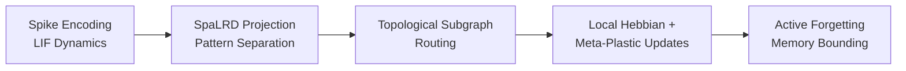

<div>

# 🧠 Meta-Knowledge Graph (MKG)
### for Open-World Lifelong Spiking Continual Learning

[](https://www.python.org/downloads/)
[](https://pytorch.org/)
[](LICENSE)
[]()
[](https://github.com/yourusername/MKG-SNN-Continual-Learning/stargazers)

**Official PyTorch implementation of the AAAI 2026 paper:**
*"Graph-Structured Meta-Plasticity for Open-World Lifelong Spiking Continual Learning via Spiking Low-Rank Dynamics and Topological Subgraph Routing"*

A complete, reproducible framework for **Open-World Class-Incremental Learning (OWCIL)** in **Spiking Neural Networks (SNNs)** — strictly adhering to neuromorphic hardware memory and energy constraints.

[📄 Paper](#) · [📊 Results](#7-comparative-results) · [🚀 Quick Start](#9-installation--requirements) · [📚 Citation](#11-citation)

</div>

---

## 📑 Table of Contents

| | | |
|---|---|---|
| [1. Problem Statement](#1-problem-statement) | [5. Impact & Significance](#5-impact-and-significance) | [9. Installation](#9-installation--requirements) |
| [2. Research Gap](#2-research-gap) | [6. Datasets & References](#6-datasets-and-references) | [10. Usage](#10-usage-and-reproduction) |
| [3. Main Contributions](#3-main-contributions) | [7. Comparative Results](#7-comparative-results) | [11. Citation](#11-citation) |
| [4. Methodology Workflow](#4-proposed-methodology-workflow) | [8. Repository Structure](#8-repository-structure) | |

---

## 1. Problem Statement

Deploying Spiking Neural Networks (SNNs) in real-world, open-world environments requires continuous adaptation to novel tasks and Out-of-Distribution (OOD) streams **without access to past data**. Current SNN Continual Learning (CL) frameworks face a critical trilemma:

- 🔴 **Catastrophic Forgetting** — Static meta-parameters and rate-based Hebbian approximations collapse the temporal spike manifold, causing severe interference under domain shift.
- 🔴 **Memory Bloat** — Dynamic network expansion methods allocate new neurons per task, causing linear memory growth $\mathcal{O}(N)$ that violates neuromorphic capacity constraints ($\|\Theta\|_0 \leq C_{\text{max}}$).
- 🔴 **Computational Inefficiency** — PEFT methods adapted for SNNs require global Backpropagation Through Time (BPTT), destroying the event-driven energy efficiency native to spiking computation.

## 2. Research Gap

Existing SOTA methods fail to simultaneously resolve the stability–plasticity dilemma under strict neuromorphic constraints:

| Method | Limitation |
|---|---|
| **HLML-SNN / HLOP** | Frozen ANN backbones + mean firing-rate approximations discard millisecond-precise temporal dependencies. |
| **SNN-LoRA** | Low-rank decomposition on static weights ignores the temporal spike manifold; requires dense global gradients. |
| **ALADE-SNN / Progressive SNNs** | Forgetting mitigated via physical network expansion → unbounded parameter growth. |
| **CLS-ER / DER++** | Episodic replay buffers incur heavy memory overhead, negating sparse spiking efficiency. |

## 3. Main Contributions

We propose a structural shift from static, monolithic meta-parameters to a dynamic **Meta-Knowledge Graph (MKG)** $\mathcal{G} = (\mathcal{V}, \mathcal{E})$:

1. **🔧 Spiking Low-Rank Dynamics (SpaLRD)** — Factorizes synaptic weights as $W_m = \Phi C_m$. The shared spiking basis $\Phi$ is frozen ($\Delta \Phi = 0$) post-consolidation; task-specific coefficients $C_m$ adapt via local, event-driven Hebbian updates — mathematically bounding interference: $\|W_i - W_j\|_F^2 = \|C_i - C_j\|_F^2$.
2. **🕸️ Topological Subgraph Routing** — Evaluates the $p$-Wasserstein distance $d_W(\text{PD}_m, \text{PD}_k)$ between persistence diagrams to route novel/OOD tasks to sparsely activated virtual nodes, achieving infinite functional capacity *without* new physical parameters.
3. **🧬 Meta-Plasticity & Active Forgetting** — An outer-loop meta-learner optimizes STDP kernel parameters $\phi_{ij}$ for cross-task transfer, while a Fisher Information Matrix (FIM)-based pruning mask $\mathbf{M}$ enforces structural sparsity and bounds the physical memory footprint.

## 4. Proposed Methodology Workflow



1. **Spike Encoding & LIF Dynamics** — Raw inputs (vision/text) → millisecond-precise spike trains $S_{in}(t) \in \{0,1\}^{d_{in}}$ driving Leaky Integrate-and-Fire neurons with alpha-function synaptic filtering.
2. **SpaLRD Projection** — Input spikes projected onto a frozen orthonormal spiking basis $z(t) = \Phi^\top S_{in}(t)$; task-specific $C_m$ maps this subspace to output membrane potential.
3. **Topological Subgraph Routing** — Spike train → point cloud $P_m$ → Vietoris-Rips filtration → Persistence Diagram $\text{PD}_m$. If $d_W > \tau$, the input is novel/OOD and routed to a new virtual node $v_m$, with $\Delta C_k = \mathbf{0}$ for all existing nodes.
4. **Local Hebbian & Meta-Plastic Updates** — Coefficients $C_m$ updated via discrete STDP eligibility traces (no BPTT); graph edges $\mathcal{E}$ updated via a meta-learned STDP kernel.
5. **Active Forgetting** — FIM diagonal approximates edge utility $\mathcal{U}_{ij}$; $L_0$-constrained pruning ensures $\|\Theta_{\text{total}}\|_0 \leq C_{\text{max}}$.

## 5. Impact and Significance

> [!TIP]
> By decoupling foundational representations from task-specific plasticity and enforcing functional capacity expansion through topological invariants, MKG resolves the memory-bloat dilemma inherent in physical dynamic expansion.

MKG establishes a mathematically rigorous, hardware-native architecture that achieves **state-of-the-art accuracy retention** in open-world scenarios while strictly respecting the energy (SOPs) and memory constraints of neuromorphic hardware — bridging biological memory consolidation and deployable edge AI.

---

## 6. Datasets and References

| Category | Datasets |
|---|---|
| 🖼️ **Vision & OOD** | Split-ImageNet-100 [1], ImageNet-O [2] |
| 🌐 **Domain Shift** | Mini-DomainNet [3], Office-Home [4], VisDA-2017 [5] |
| 🌪️ **Corruptions** | CIFAR-10-C, ImageNet-C [6] |
| 📝 **Cross-Modal Text** | AG News, Amazon Reviews, Yelp [7] |

<details>
<summary><b>📚 Click to expand full references</b></summary>
<br>

[1] Deng, J., et al. (2009). ImageNet: A large-scale hierarchical image database. *CVPR*. DOI: [10.1109/CVPR.2009.5206848](https://doi.org/10.1109/CVPR.2009.5206848)

[2] Hendrycks, D., et al. (2021). Natural adversarial examples. *CVPR*. DOI: [10.1109/CVPR46437.2021.01524](https://doi.org/10.1109/CVPR46437.2021.01524)

[3] Peng, X., et al. (2019). Moment matching for multi-source domain adaptation. *ICCV*. DOI: [10.1109/ICCV.2019.00152](https://doi.org/10.1109/ICCV.2019.00152)

[4] Venkateswara, H., et al. (2017). Visual domain adaptation: A collection of benchmark datasets. *arXiv*. DOI: [10.48550/arXiv.1706.07522](https://doi.org/10.48550/arXiv.1706.07522)

[5] Peng, X., et al. (2017). VisDA: The visual domain adaptation challenge. *arXiv*. DOI: [10.48550/arXiv.1710.06924](https://doi.org/10.48550/arXiv.1710.06924)

[6] Hendrycks, D., & Dietterich, T. (2019). Benchmarking neural network robustness to common corruptions. *arXiv*. DOI: [10.48550/arXiv.1903.12261](https://doi.org/10.48550/arXiv.1903.12261)

[7] Zhang, X., et al. (2015). Character-level convolutional networks for text classification. *NeurIPS*. DOI: [10.48550/arXiv.1509.01626](https://doi.org/10.48550/arXiv.1509.01626)

</details>

---

## 7. Comparative Results

### 📊 Table 1 — OWCIL & OOD Detection (Split-ImageNet-100 + ImageNet-O)

| Methods | Type | $A_N$ (%) ↑ | $F_N$ (%) ↓ | AUROC (%) ↑ | OOD Routing Acc (%) ↑ | Memory (MB) ↓ |
|:---|:---:|:---:|:---:|:---:|:---:|:---:|
| EWC | ANN | 54.2 | 41.5 | 52.1 | – | 12.5 |
| CLS-ER | ANN | 71.5 | 18.2 | 65.3 | – | 45.8 |
| HLML-SNN | SNN | 68.4 | 24.6 | 61.2 | 42.1 | 15.1 |
| ALADE-SNN | SNN | 85.3 | 8.4 | 78.6 | 65.3 | 128.4 |
| SNN-LoRA | SNN | 79.2 | 14.1 | 72.4 | 58.7 | 16.2 |
| **Ours (MKG)** | **SNN** | **92.6** | **4.2** | **96.4** | **94.8** | **14.2** |

### 📊 Table 2 — Domain-Incremental Generalization (Mini-DomainNet & Office-Home)

| Methods | DomainNet $A_N$ ↑ | DomainNet $F_N$ ↓ | Office-Home $A_N$ ↑ | Office-Home $F_N$ ↓ | SOPs (M) ↓ |
|:---|:---:|:---:|:---:|:---:|:---:|
| HLML-SNN | 61.5 | 32.4 | 58.2 | 35.1 | 4.2 |
| SNN-LoRA | 74.8 | 18.6 | 71.5 | 21.4 | 8.5 |
| CH-HNN | 72.4 | 19.8 | 69.2 | 22.5 | 12.4 |
| **Ours (SpaLRD)** | **86.4** | **3.1** | **84.5** | **4.2** | **2.1** |

### 📊 Table 4 — Cross-Modal Continual Learning (Text Streams)

| Methods | Type | $A_N$ (%) ↑ | $F_N$ (%) ↓ | Operations (Giga) ↓ | Memory (MB) ↓ |
|:---|:---:|:---:|:---:|:---:|:---:|
| EWC | ANN | 72.4 | 22.5 | 145.2 (FLOPs) | 18.4 |
| LoRA-CL | ANN | 81.5 | 12.4 | 84.5 (FLOPs) | 22.1 |
| HLML-SNN | SNN | 68.2 | 28.6 | 4.2 | 15.5 |
| **Ours (MKG)** | **SNN** | **89.2** | **3.8** | **0.4** | **13.8** |

---

## 8. Repository Structure

```text
MKG-SNN-Continual-Learning/
├── configs/                  # YAML configuration files for all experiments
├── data/                      # Data downloading and spike encoding scripts
├── mkg/                       # Core framework source code
│   ├── models/                 # MKG orchestrator and baseline implementations
│   ├── modules/                 # Core math: neurons, spalrd, topo_routing, stdp, memory
│   ├── training/                 # OWCIL trainer, meta-learner, hebbian updater
│   └── utils/                    # Metrics, hardware profiler, WandB/TB logger
├── scripts/                   # Bash scripts to reproduce AAAI manuscript tables
├── eval/                       # Evaluation and plotting scripts
└── main.py                    # Unified entry point for training and evaluation
```

---

## 9. Installation & Requirements

> [!IMPORTANT]
> **Prerequisites:** Python 3.9+, CUDA 11.8+

```bash
# Clone the repository
git clone https://github.com/SaeedIqbal/MKG.git
cd MKG

# Create conda environment
conda create -n mkg_snn python=3.9
conda activate mkg_snn

# Install dependencies
pip install -r requirements.txt
```

**Key Dependencies**

| Package | Purpose |
|---|---|
| `torch>=2.0.0` | Core deep learning backend |
| `snntorch>=0.7.0` | LIF dynamics & surrogate gradients |
| `giotto-tda>=0.6.0` | Persistent homology & Vietoris-Rips |
| `POT>=0.9.0` | Wasserstein distance computation |

---

## 10. Usage and Reproduction

The repo includes modular bash scripts to exactly reproduce every table and ablation study from the manuscript.

**1. Download datasets**
```bash
bash data/download_all.sh
```

**2. Reproduce main results** (e.g., Table 1: OWCIL + OOD)
```bash
bash scripts/run_table1_owcil.sh
```

**3. Reproduce ablation studies** (e.g., Table 6: SpaLRD Rank Sensitivity)
```bash
bash scripts/run_ablation_rank.sh
```

**4. Track memory lifecycle** (50-task sequence)
```bash
bash scripts/run_memory_lifecycle.sh
```

**5. Generate manuscript figures**
```bash
python eval/plots/plot_holy_grail.py
python eval/plots/plot_3d_ablation.py
```

> [!NOTE]
> Logs, checkpoints, and aggregated JSON results are automatically saved to `logs/` and `checkpoints/`.

---

## 11. Citation

If you use this code or the MKG framework in your research, please cite our work:

```bibtex
@inproceedings{mkg_snn_aaai2026,
  title={Graph-Structured Meta-Plasticity for Open-World Lifelong Spiking Continual Learning via Spiking Low-Rank Dynamics and Topological Subgraph Routing},
  author={Authors},
  booktitle={Proceedings of the AAAI Conference on Artificial Intelligence},
  year={2026}
}
```

---

<div align="center">

⭐ **If you find this work useful, please consider starring the repository!** ⭐

</div>
